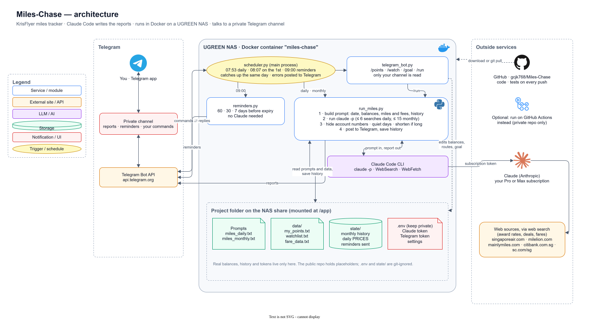

# Miles Chase

A Telegram bot that tracks your KrisFlyer miles and Singapore Airlines award options. It collects
points on Citi Rewards and Standard Chartered Rewards, and Citi Miles on Citi PremierMiles. Claude writes the reports
with `claude -p` and web search. Everything runs in a Docker container on your NAS.

| What | When (Singapore time) | Uses Claude |
| --- | --- | --- |
| **Daily fare tracker**: SIA fares for your watchlist vs Saver awards, a verdict per route, fare drops and deals, plus new deals per region (China first), only for regions with an update. Quiet days: nothing (DAILY_QUIET=silent). | Every day, 18:00 | Yes |
| **Monthly coach report**: balances, miles and transfer fees, expiry watch, what you can book, goal progress, which card to use, deals and tips. | 1st of the month, 08:07 | Yes |
| **New-deal alerts**: a message as soon as The MileLion or Mainly Miles posts about KrisFlyer, SIA, your cards or a city on your watchlist. | Checked every 30 minutes | No |
| **Expiry reminders**: a message 60, 30 and 7 days before any points or miles expire. | Every day, 09:00 | No |
| **Telegram commands**: update balances, the watchlist and your goal, or run a report now. | Any time | No |

If the NAS is off at a scheduled time, that job runs when it's back on, as long as it's still the
same day. The app looks after itself: it retries temporary errors, lets Claude repair broken data,
and restarts if it ever gets stuck. See [Staying healthy](#staying-healthy).

## Contents

- [How it fits together](#how-it-fits-together)
- [Setup on a UGREEN NAS](#setup-on-a-ugreen-nas)
- [Telegram commands](#telegram-commands)
- [Your data files](#your-data-files)
- [How miles and fees are calculated](#how-miles-and-fees-are-calculated)
- [How the reports work](#how-the-reports-work)
- [New-deal alerts](#new-deal-alerts)
- [Staying healthy](#staying-healthy)
- [Privacy and security](#privacy-and-security)
- [After the first reports](#after-the-first-reports)
- [Settings](#settings)
- [Keeping it up to date](#keeping-it-up-to-date)
- [Running on a computer](#running-on-a-computer)
- [Running on GitHub Actions instead](#running-on-github-actions-instead)
- [Troubleshooting](#troubleshooting)
- [Files and tests](#files-and-tests)

## How it fits together



1. **`scheduler.py`** is the container's main process. It starts each job at its time, and in between
   it checks Telegram for your commands.
2. **`telegram_bot.py`** handles those commands. It edits your files in `data/`, or asks for a report now.
3. **`run_miles.py`** builds the prompt from the prompt files and your data, then runs `claude -p`.
   Claude searches the web for award rates, deals and fares, using your Claude subscription.
4. The runner then checks the report, posts it to your channel, and saves history in `state/`.
5. **`reminders.py`** posts expiry reminders straight to Telegram. It doesn't use Claude.
6. **`news_watch.py`** checks the miles blogs every 30 minutes and posts new relevant deals. It
   doesn't use Claude either.
7. If a job fails, **`repair.py`** asks `claude -p` to fix it, and **`healthcheck.py`** restarts
   the container if the scheduler gets stuck.

The code comes from GitHub, where the tests run on every push. Your balances, history and tokens
stay in the folder on the NAS.

To edit the diagram, open `docs/architecture.drawio.svg` in [draw.io](https://app.diagrams.net)
(File → Open from → Device) or in VS Code with the Draw.io Integration extension. Save it in the
same format, and GitHub shows the updated picture.

## Setup on a UGREEN NAS

Tested for a DXP4800 Pro on UGOS Pro, but any machine with Docker works the same way.

### 1. Create the Telegram bot

1. In Telegram, message **@BotFather**, send `/newbot` and follow the steps. Copy the **bot token**.
2. Create a **private** channel (it will show your balances) and add the bot as an **admin**.
   The bot must be an admin to read your commands there.
3. Post any message in the channel, then open
   `https://api.telegram.org/bot<YOUR_TOKEN>/getUpdates` in a browser. Copy the `chat` → `id`
   value, which starts with `-100`. That's your **chat ID**.

### 2. Get a Claude token

The reports run on your Claude Pro or Max subscription. On your computer:

```sh
npm install -g @anthropic-ai/claude-code   # needs Node.js 18 or later
claude setup-token                         # sign in, then copy the token it prints
```

Reports count towards your subscription's usage limits. To pay per use instead, use an API key from
console.anthropic.com as `ANTHROPIC_API_KEY`. Set only one of the two.

### 3. Fill in the folder

Download this repository (Code → Download ZIP, or `git clone`), then in the `Miles-Chase` folder:

1. Copy `.env.example` to `.env` and fill it in:
   ```
   CLAUDE_CODE_OAUTH_TOKEN=<token from step 2>
   TELEGRAM_BOT_TOKEN=<token from step 1>
   TELEGRAM_CHAT_ID=<chat ID from step 1>
   ```
   Keep `.env` private. It's never committed to git.
2. Edit `data/my_points.txt` with your balances and `data/watchlist.txt` with your routes. See
   [Your data files](#your-data-files). Replace every `[placeholder]`; the reports stop with an
   error if one is left.

### 4. Start it on the NAS

1. Install **Docker** from the UGOS App Center.
2. Copy the whole `Miles-Chase` folder, including `.env`, to a shared folder on the NAS
   (for example `docker/Miles-Chase`) with the UGOS Files app or over SMB. In the UGOS shared
   folder permissions, give only your own account access, since `.env` holds your tokens.
3. Start the container, either:
   - **Docker app:** Project → Create, choose the `Miles-Chase` folder so it picks up
     `docker-compose.yml`, then deploy; or
   - **SSH** (Control Panel → Terminal → enable SSH), then in the folder:
     ```sh
     sudo docker compose up -d --build
     ```
4. Check the container log shows `scheduler started`. After about two minutes, `sudo docker ps`
   should show the container as `(healthy)`.
5. Send a test report now:
   ```sh
   sudo docker exec miles-chase python3 run_miles.py daily --full
   ```
   Then send `/points` in your channel. The bot replies within a few seconds, or after a report
   finishes if one is running.

### 5. Finish up

- [ ] Test report arrived in your Telegram channel
- [ ] `/points` shows the right balances, miles and fees
- [ ] `python3 run_miles.py reminders --dry-run` (run inside the container with
      `sudo docker exec miles-chase ...`) lists any reminders you expect
- [ ] On GitHub, disable the **Miles reports** workflow (Actions → Miles reports → ··· →
      Disable workflow) so it doesn't also run, and fail, every morning
- [ ] Optional: in the repository settings, make `main` the default branch and delete any old
      `claude/...` branches

## Telegram commands

Post these in your channel. Messages from any other chat are ignored.

| Command | What it does |
| --- | --- |
| `/points` | Miles and transfer fee per card, totals, expiry dates and your goal |
| `/points CR 52000` | Set a balance: `CR`, `CPM`, `SCR` or `KF`. The expiry is kept. |
| `/points SCR 31000 exp 2027-06` | Set a balance and its expiry month |
| `/watch` | List your watchlist routes, numbered |
| `/watch add SIN Bali, Jun 2027` | Add a route |
| `/watch remove 2` | Remove route number 2 |
| `/goal` | Show your goal |
| `/goal Tokyo business, 2 pax, Mar 2027` | Set your goal (tracked in the monthly report) |
| `/goal clear` | Remove your goal |
| `/run daily` | Run the daily report now, always in full |
| `/run monthly` | Run the monthly report now |
| `/help` | List the commands |

## Your data files

Both are plain text. Lines starting with `#` are ignored. You can edit them on the NAS share or with
the commands above; changes apply on the next run, with no restart needed.

**`data/my_points.txt`**: your balances. Update them each month before the 1st, or with `/points`.

```
CR: 52000 exp 2027-01        Citi Rewards points and expiry month
CPM: 20000                   Citi PremierMiles: already miles (Citi Miles), they don't expire
SCR: 31000 exp 2027-06       Standard Chartered Rewards points and expiry month
KF: 12000                    miles already in KrisFlyer
Goal: Tokyo business, 2 pax, Mar 2027        optional
Family: Dad KF 30000                         optional, for combined totals
Spend this month: CR online 600              optional, for bonus cap warnings
Card fee months: CR Mar, CPM Jul, SCR Nov    optional, for fee waiver reminders
```

**`data/watchlist.txt`**: one route per line for the daily tracker, such as `SIN Tokyo, Mar 2027`.

## How miles and fees are calculated

The script works out miles from your card points **before transfer**, and all reports and `/points`
use the same figures:

| Card | Rate | Transfer fee |
| --- | --- | --- |
| Citi Rewards (`CR`) | 25,000 points = 10,000 miles, so 52,000 points = 20,800 miles | S$27.25 |
| Citi PremierMiles (`CPM`) | already miles: 1 Citi Mile = 1 KrisFlyer mile | S$27.25 |
| SC Rewards (`SCR`) | 25,000 points = 10,000 miles | about S$27 |
| KrisFlyer (`KF`) | already miles | none |

The fee is one per card, since each card's points are moved in one transfer. A card with no points
adds no fee. For example:

```
CR: 52,000 points = 20,800 KrisFlyer miles, transfer fee S$27.25
CPM: 20,000 Citi Miles = 20,000 KrisFlyer miles, transfer fee S$27.25
SCR: 31,000 points = 12,400 KrisFlyer miles, transfer fee about S$27.00
KF: 12,000 miles already in KrisFlyer
Total: 65,200 miles
Transfer fees to pay: about S$81.50 (one transfer per card)
```

The rates and fees are in `CONVERSIONS` and `TRANSFER_FEES` at the top of `run_miles.py`. To use
your own miles figure in the daily report, add `MY MILES: 65000` to `data/watchlist.txt`.

## How the reports work

For each report, `run_miles.py`:

1. Builds the prompt from `miles_daily.txt` or `miles_monthly.txt`. It fills in today's date, your
   balances, the calculated miles and fees, last month's balances and yesterday's fares.
2. Runs `claude -p` with web search (at most 6 searches daily, 15 monthly).
3. Checks the output before posting. It hides card numbers and any run of 10 or more digits, such
   as a KrisFlyer number, except inside links. It also removes markdown.
4. If a report is over its length limit (2,000 characters daily, 3,500 monthly), asks Claude once
   more, without web search, to shorten it while keeping every number.
5. Posts it to Telegram and saves history in `state/`. Each section (the alerts, each route, each
   monthly section) goes out as its own message, and only the first one makes a sound. Short
   sections next to each other, such as deals, tip and sources, share one message. Set
   `SPLIT_MESSAGES=off` to get one long message instead.

**Quiet days.** The daily report starts with a `STATUS: NEWS` or `STATUS: QUIET` line, which is
removed before posting. NEWS means an alert, a fare change or a newly found fare. On a quiet day
you get one line:
`✈️ 30 Sep: no fare changes or deals on your watchlist today. Send /run daily for the full report.`
See `DAILY_QUIET` in [Settings](#settings).

**Expiry reminders.** These read the `exp YYYY-MM` dates in `data/my_points.txt` and treat each as
the end of that month. A message is sent at 60, 30 and 7 days before, each one only once:

```
⏰ Citi Rewards: 52,000 points (20,800 KrisFlyer miles) expire at the end of Oct 2026, in 31 days. Transfer fee S$27.25.
Search Saver seats on singaporeair.com, then transfer in the Citi Mobile app. Allow 1 to 3 working days.
```

**What to expect from fares.** Claude reports only fares it actually saw on a page, and writes
"not found" otherwise. Live SIA fares are often not visible to web search, so expect some "not found"
routes. Claude also can't see award seat availability; always search Saver seats on singaporeair.com
before transferring points. For reliable fares, put results from a flight price API in
`data/fare_data.txt`, and Claude will use those instead of searching.

## New-deal alerts

Every 30 minutes the app reads the news feeds of [The MileLion](https://milelion.com) and
[Mainly Miles](https://mainlymiles.com). This doesn't use Claude. When there's a new post that
mentions KrisFlyer, Singapore Airlines, Scoot, Saver awards, Spontaneous Escapes, a transfer bonus,
your cards or a city on your watchlist, you get one message:

```
🆕 New from the miles blogs

KrisFlyer Spontaneous Escapes: November 2026
The MileLion · https://milelion.com/...
```

- Each post is sent once. The very first check only notes what's already there, so you don't get
  old posts.
- If a blog is down, it's skipped and tried again next time.
- Change how often it checks with `NEWS_EVERY_MINUTES`, or turn it off with `NEWS_ALERTS=off`.
- To test it: `sudo docker exec miles-chase python3 run_miles.py news --no-send` prints what's new
  without sending or remembering it.

Combined with `DAILY_QUIET=silent`, you only hear from the app when there's something new.

## Staying healthy

The container is set up to keep running without you:

| Problem | What happens |
| --- | --- |
| A temporary error: no internet, a timeout, Claude busy | Retried up to 3 times, 15 minutes apart. You're told only if all tries fail. |
| Broken data, such as a typo in `data/my_points.txt` or a damaged history file | Claude (`claude -p`) looks at the error and fixes what it safely can, then the job is re-run. You get a message saying what was wrong, what it changed and whether the re-run worked. |
| Something only you can fix, such as a missing balance or an expired Claude token | Claude changes nothing and tells you what to do, for example "Send /points CPM <your balance>". |
| The app gets stuck | The Docker healthcheck notices within about 12 minutes and restarts the container. |
| The app crashes, or the NAS reboots | Docker starts it again automatically. |
| An unexpected error in the scheduler | It's logged, you get one message about it an hour at most, and the app carries on. |

**What the self-repair may change:** Claude can read the whole project, but it's only allowed to
edit files in `data/` and `state/`. It can't change the code, the prompts or `.env`, and it's told
never to invent balances. It runs at most once per job per day. Turn it off with `SELF_REPAIR=off`.

## Privacy and security

- **Keep the Telegram channel private.** Reports show your balances and goals.
- **Keep `.env` out of git and off public shares.** It holds your Claude and Telegram tokens.
  `.gitignore` already excludes it. On the NAS, limit the shared folder to your own account.
- **This repository is public.** Don't commit your filled-in `data/` files, `state/` or `.env`.
  Keep your real data only on the NAS, or make the repository private first.
- **Account numbers never reach Telegram.** Card numbers and any run of 10 or more digits are
  hidden before posting, even if they end up in the output.
- **Only your channel can control the bot.** Commands from any other chat are ignored.
- **If a token leaks:** for Telegram, send `/revoke` to @BotFather and put the new token in `.env`.
  For Claude, run `claude setup-token` again and update `.env`. Then restart the container.

## After the first reports

Give it a week or two, then check:

- **Many "not found" fares?** Web search often can't see live SIA fares. The fix is a flight price
  API: put its results in `data/fare_data.txt` (one line per route with the fare and date), and
  Claude uses those instead of searching. This needs an account with a fare API provider.
- **A section always empty or a number wrong?** Adjust the wording in `miles_monthly.txt` or
  `miles_daily.txt`. The rules, baseline facts and report sections are all plain text.
- **"Baseline changes" listed in a monthly report?** Update that figure in both prompt files. If
  it's a transfer fee, also update `TRANSFER_FEES` in `run_miles.py`.
- **Too many or too few daily messages?** Change `DAILY_QUIET` in `.env`.
- **Something odd?** Check the container log with `sudo docker logs --tail 50 miles-chase`.

## Settings

All settings go in `.env`:

| Setting | What it does |
| --- | --- |
| `CLAUDE_CODE_OAUTH_TOKEN` | Your subscription token from `claude setup-token` |
| `ANTHROPIC_API_KEY` | Pay-per-use alternative to the token. Set only one. |
| `TELEGRAM_BOT_TOKEN`, `TELEGRAM_CHAT_ID` | Where reports are posted and commands are read |
| `SPLIT_MESSAGES` | `sections` (default) posts each report section as its own message, with only the first one making a sound. `off` posts one long message. |
| `NEWS_ALERTS` | `on` (default) or `off`: new-deal alerts from the miles blogs |
| `NEWS_EVERY_MINUTES` | How often to check the blogs, default `30` (minimum 5) |
| `SELF_REPAIR` | `on` (default) or `off`: let Claude fix broken data after a failed job |
| `DAILY_QUIET` | Quiet days: `line` (default) posts one short line, `silent` posts nothing, `off` always posts the full report |
| `CLAUDE_MODEL` | Optional model override for `claude -p` |
| `CLAUDE_BIN` | Path to `claude`, only needed under cron. Don't set it for Docker. |

The schedule times are `DAILY_AT`, `MONTHLY_AT` and `REMINDERS_AT` in `scheduler.py`. After changing
them, restart the container.

## Keeping it up to date

- **Balances:** use `/points`, or edit `data/my_points.txt` before the 1st of each month.
- **Baseline facts:** the prompts hold award rates, fees and earn rates checked in Sept 2026. When a
  monthly report lists something under "Baseline changes", update that figure in `miles_monthly.txt`
  and `miles_daily.txt`. If it's a transfer fee, also update `TRANSFER_FEES` in `run_miles.py`.
- **Code updates:** replace the code files on the NAS, or run `git pull`, then restart the
  container. Keep your `.env`, `data/` and `state/`.
- **Claude Code updates:** rebuild the image:
  ```sh
  sudo docker compose build --no-cache && sudo docker compose up -d
  ```

## Running on a computer

This is useful for testing before moving to the NAS. You need Python 3.9+ and Claude Code.

```sh
claude                                   # sign in once with your subscription, then /exit
cp .env.example .env                     # add TELEGRAM_BOT_TOKEN and TELEGRAM_CHAT_ID

python3 run_miles.py daily --dry-run     # show the prompt that would be sent, no Claude call
python3 run_miles.py daily --no-send     # run Claude, print the report instead of posting
python3 run_miles.py daily --full        # run Claude and post the full report
python3 run_miles.py monthly             # run Claude and post
python3 run_miles.py reminders --dry-run # show any expiry reminders due today
python3 scheduler.py                     # run everything on schedule, plus Telegram commands
```

Local runs write to `state/`. When moving to the NAS, copy `state/` too so the history comes along.

To schedule with cron instead of `scheduler.py`, set `CLAUDE_BIN` in `.env` (from `which claude`)
and use full paths. The machine's clock must be on Singapore time:

```cron
53 7 * * * cd /path/to/Miles-Chase && /usr/bin/python3 run_miles.py daily >> miles.log 2>&1
7 8 1 * *  cd /path/to/Miles-Chase && /usr/bin/python3 run_miles.py monthly >> miles.log 2>&1
0 9 * * *  cd /path/to/Miles-Chase && /usr/bin/python3 run_miles.py reminders >> miles.log 2>&1
```

Telegram commands only work while `scheduler.py` is running.

## Running on GitHub Actions instead

`.github/workflows/miles.yml` can run the daily and monthly reports on GitHub instead of the NAS.
Expiry reminders and Telegram commands don't run there.

1. **Make the repository private.** The workflow commits your balance history to `state/`, so it
   refuses to run in a public repository.
2. Add repository secrets (Settings → Secrets and variables → Actions): `CLAUDE_CODE_OAUTH_TOKEN`
   (or `ANTHROPIC_API_KEY`), `TELEGRAM_BOT_TOKEN` and `TELEGRAM_CHAT_ID`. Optionally add a variable
   `CLAUDE_MODEL`.
3. Commit your filled-in `data/` files.
4. Test it with Actions → Miles reports → Run workflow.

**If you use the NAS**, disable this workflow (Actions → Miles reports → ··· → Disable workflow) so it
doesn't also run, and fail, every morning.

## Troubleshooting

| Problem | Fix |
| --- | --- |
| The container keeps restarting | Check `sudo docker logs --tail 50 miles-chase` for the error, and `sudo docker ps` for its health |
| `still has a placeholder` | Replace every `[...]` in `data/my_points.txt` or `data/watchlist.txt` |
| Telegram `chat not found` | Check `TELEGRAM_CHAT_ID`, including the `-100` at the start |
| The bot ignores commands | Make the bot an admin of the channel, and post in that channel |
| `the claude command isn't installed` | On a computer, install Claude Code. Under cron, set `CLAUDE_BIN`. |
| Claude errors about login or auth | Run `claude setup-token` again and update `.env`, then restart the container |
| No daily message | Probably a quiet day with `DAILY_QUIET=silent`. Check the container log. |
| Fares show "not found" | See [What to expect from fares](#how-the-reports-work) |

To see what the container is doing:

```sh
sudo docker logs --tail 50 miles-chase
```

## Files and tests

| File | Purpose |
| --- | --- |
| `miles_daily.txt`, `miles_monthly.txt` | The prompts: rules, baseline facts and report layout |
| `data/my_points.txt`, `data/watchlist.txt` | Your balances, goal and routes |
| `data/fare_data.txt` | Optional fares from a flight price API |
| `run_miles.py` | Builds the prompt, runs `claude -p`, checks and posts the report |
| `scheduler.py` | Runs the jobs on schedule and answers Telegram commands (the container's main process) |
| `telegram_bot.py` | The Telegram commands |
| `reminders.py` | Expiry reminders |
| `news_watch.py` | New-deal alerts from the miles blogs' feeds |
| `repair.py` | Self-repair with `claude -p` after a failed job |
| `healthcheck.py` | Docker healthcheck: restarts the container if the scheduler gets stuck |
| `state/` | History written by the runner: monthly balances, daily prices, sent reminders |
| `Dockerfile`, `docker-compose.yml` | The NAS container |
| `docs/architecture.drawio.svg` | The architecture diagram. It opens in draw.io for editing. |
| `.github/workflows/` | Tests on every push, and the optional GitHub Actions schedule |
| `tests/` | Unit tests |

Run the tests. They need no network, Claude or Telegram:

```sh
python3 -m unittest discover -s tests -v
```
